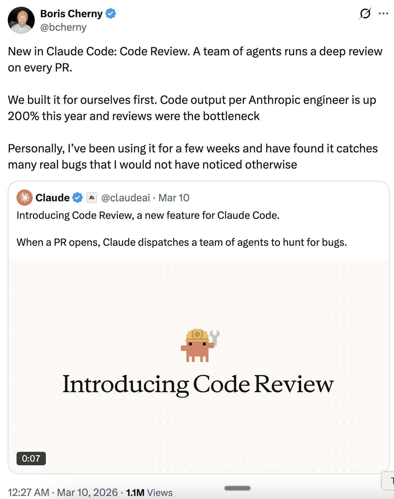

# 代码审查与测试时计算 —— Boris Cherny 的技巧

Boris Cherny ([@bcherny](https://x.com/bcherny))，Claude Code 的创造者，于 2026 年 3 月 10 日分享的见解总结。

<table width="100%">
<tr>
<td><a href="../">← 返回 Claude Code 最佳实践</a></td>
<td align="right"></td>
</tr>
</table>

---

## 1/ 代码审查介绍

Claude Code 新功能：**代码审查**。一组代理团队对每个 PR 进行深度审查。

- 首先为 Anthropic 自己的团队构建 —— 今年每位工程师的代码产出增长了 **200%**，审查成为了瓶颈
- Boris 已经使用了几周，发现它捕获了许多他否则不会注意到的真正 bug
- 当 PR 打开时，Claude 会派出一组代理团队来搜寻 bug

---

## 2/ 测试时计算与多个上下文窗口

粗略地说，你对编码问题投入的 token 越多，结果就越好。Boris 称之为 **测试时计算**。

- 使用**独立的上下文窗口**会让结果更好 —— 这正是子代理的工作原理，也是为什么一个代理可能产生 bug，而另一个（使用完全相同的模型）可以找到它们
- 类似于工程团队：如果 Boris 产生了 bug，他的同事审查代码时可能比他自己更可靠地发现它
- 在极限情况下，代理可能会写出完美的无 bug 代码 —— 在此之前，**多个不相关的上下文窗口**往往是一个好的方法

---

## 来源

- [Boris Cherny (@bcherny) 在 X 上 — 2026 年 3 月 10 日](https://x.com/bcherny)