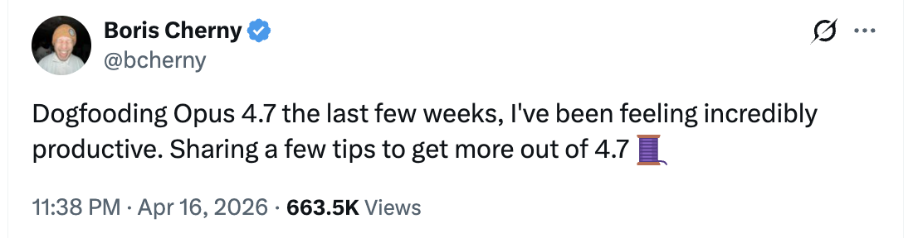
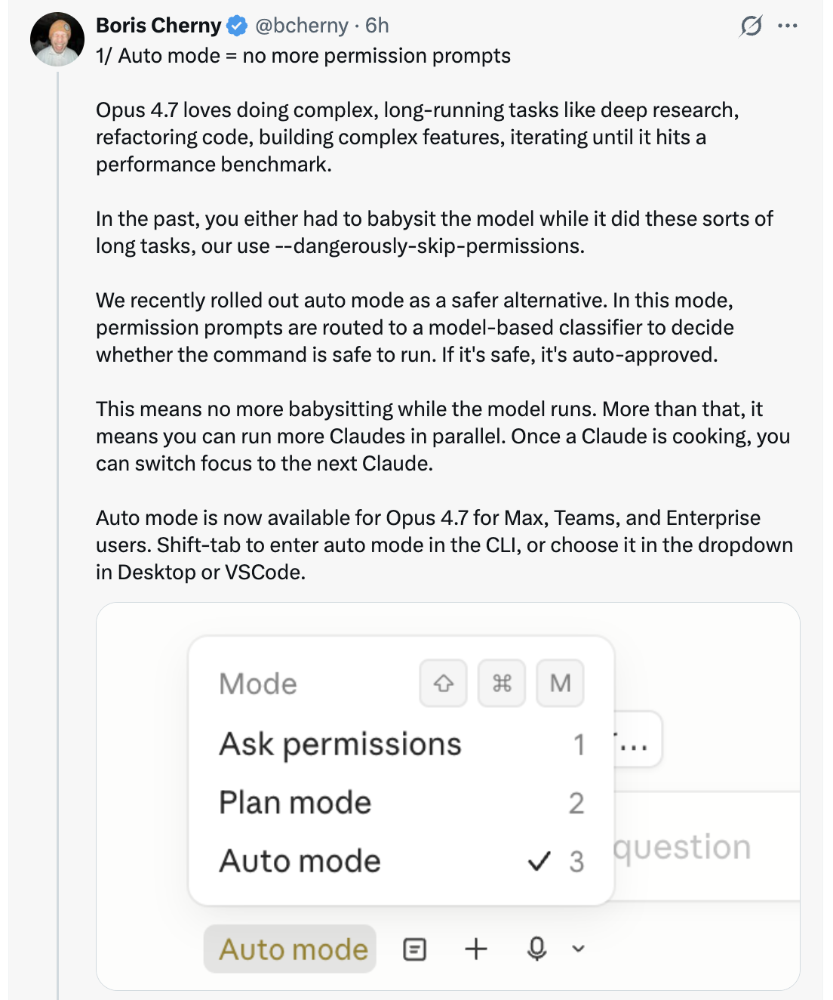
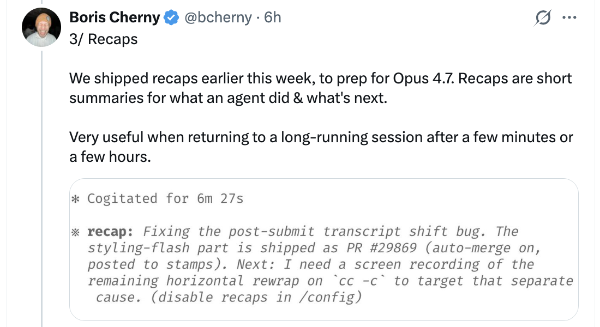
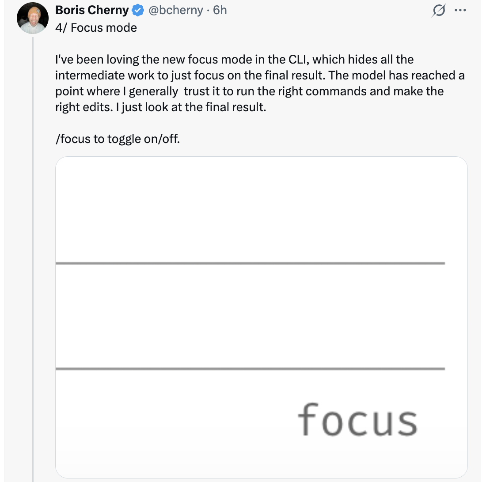
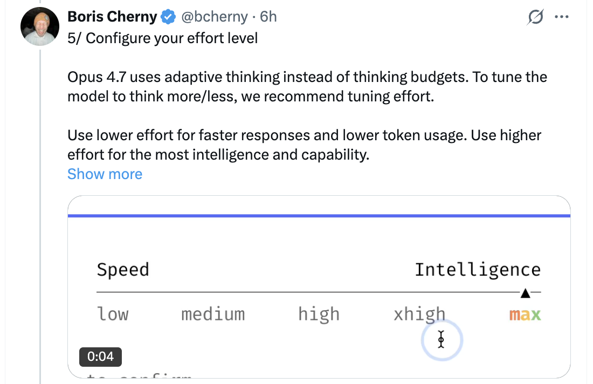

# 充分利用 Opus 4.7 的 6 个技巧 — Boris Cherny

Boris Cherny（[@bcherny](https://x.com/bcherny)），Claude Code 的创始人，在 2026 年 4 月 16 日分享了一系列技巧 — 在连续几周 dogfooding Opus 4.7 之后。

<table width="100%">
<tr>
<td><a href="../">← 返回 Claude Code 最佳实践</a></td>
<td align="right"></td>
</tr>
</table>

---

## 背景

Boris 连续几周 dogfooding Opus 4.7 后，感到"难以置信的高效"，分享了六种充分利用新模型的方法 — 从权限自动化到 effort 调优再到验证模式。

<a href="https://x.com/bcherny"></a>

---

## 1/ 自动模式 — 无需权限提示

Opus 4.7 喜欢执行复杂的长时间运行任务：深度研究、重构代码、构建复杂功能、迭代直到达到性能基准。过去，对于这类长时间任务，你要么需要盯着模型操作，要么使用 `--dangerously-skip-permissions`。

Anthropic 最近推出了**自动模式**作为更安全的替代方案。在此模式下，权限提示由基于模型的分类器路由，决定是否允许该命令运行：

- 如果安全，自动批准
- 如果有风险，暂停并询问

这意味着不再需要盯着模型运行。更重要的是，这意味着你可以并行运行更多 Claude 实例 — 如果安全，可以切换到下一个 Claude。

自动模式现在可供 Max、Teams 和 Enterprise 用户在 Opus 4.7 上使用。在 CLI 中按 **Shift+Tab** 在 `询问权限` → `计划模式` → `自动模式` 之间循环，或在 Desktop 或 VS Code 中从下拉菜单中选择。

<a href="https://x.com/bcherny"></a>

---

## 2/ 全新的 /fewer-permission-prompts Skill

Anthropic 发布了一个新的 `/fewer-permission-prompts` skill。它扫描你的会话历史，找到常见的安全但反复请求权限的 bash 和 MCP 命令。然后它会建议一份要添加到权限允许列表的命令清单。

使用此功能来优化你的权限设置，避免不必要的权限提示，尤其是你不使用自动模式时。

<a href="https://x.com/bcherny"></a>

---

## 3/ Recaps（回顾）

Anthropic 在本周早些时候发布了 **recaps**，为 Opus 4.7 做准备。Recaps 是关于代理做了什么以及接下来要做什么的简短总结。

当你从几分钟或几小时后返回一个长时间运行的会话时，这非常有用：

```
* Cogitated for 6m 27s

* recap: 修复提交后转录本移位 bug。样式闪烁部分已作为 PR #29869 交付
  （自动合并开启，已发布到 stamps）。下一步：我需要一段关于 `cc -c`
  上剩余水平换行的屏幕录制，以针对那个独立的原因。 （在 /config 中禁用 recaps）
```

如果你不需要 recaps，可以在 `/config` 中禁用。

<a href="https://x.com/bcherny"></a>

---

## 4/ 专注模式

Boris 一直在喜爱 CLI 中全新的**专注模式**，它隐藏了所有中间工作，只关注最终结果。模型已经到了他通常信任它运行正确命令和进行正确编辑的地步。他只看最终结果。

使用 `/focus` 来切换开关。

<a href="https://x.com/bcherny"></a>

---

## 5/ 配置你的 Effort 级别

Opus 4.7 使用**自适应思维**而不是思维预算。要将模型调校为多思或少思，调整 effort。

- **更低的 effort** — 更快的响应和更低的 token 使用量
- **更高的 effort** — 最强的智能和能力

滑块提供五个级别：`低` · `中` · `高` · `超高` · `最高` — 左侧是速度，右侧是智能。

<a href="https://x.com/bcherny"></a>

---

## 6/ 给 Claude 一个验证工作的方式

最后，确保 Claude 有办法验证它的工作。这一点一直以来都很重要 — 现在 4.7 能给你带来 2-3 倍的产出，所以它比以往任何时候都更重要。

验证因任务不同而有所不同：

- **后端工作** — 让 Claude 运行你的服务器/服务来端到端测试
- **前端工作** — 使用 [Claude Chromium 扩展](https://code.claude.com/docs/en/chrome) 给 Claude 一种控制浏览器的方式
- **桌面应用** — 使用 Computer Use

Boris 现在的提示看起来像 `Claude do blah blah /go`，其中 `/go` 是一个 skill：

1. 使用 bash、浏览器或 computer use 端到端自测
2. 运行 `/simplify`
3. 提出 PR

对于长时间运行的工作，验证甚至更重要 — 当你回到一个任务时，你知道代码是工作的。

<a href="https://x.com/bcherny"></a>

---

## 来源

- [Boris Cherny (@bcherny) — 2026 年 4 月 16 日 X](https://x.com/bcherny)