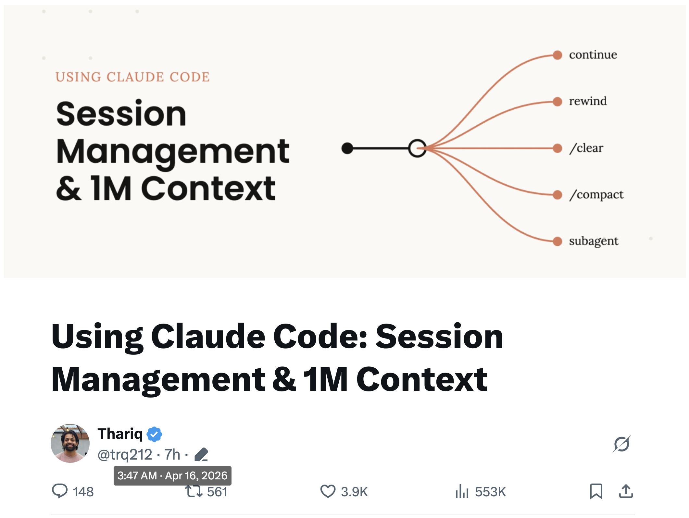
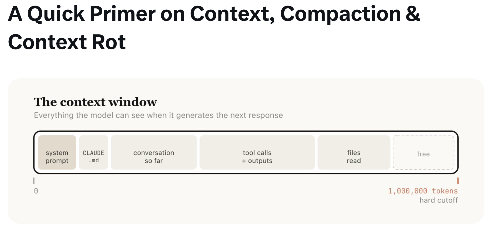
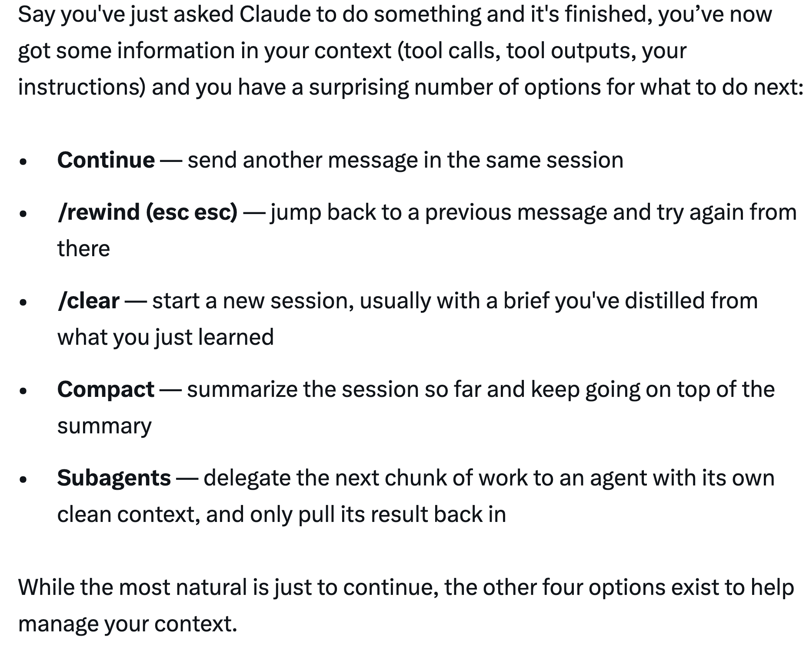
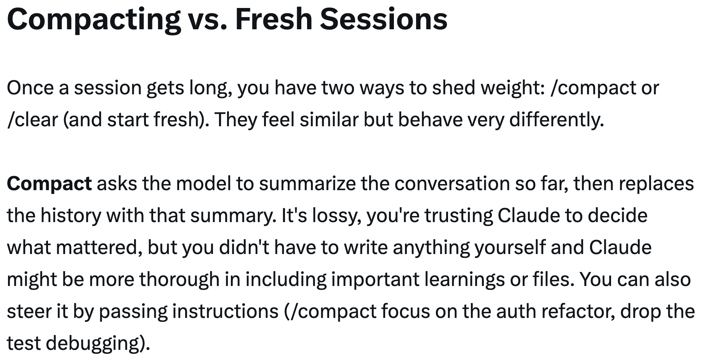
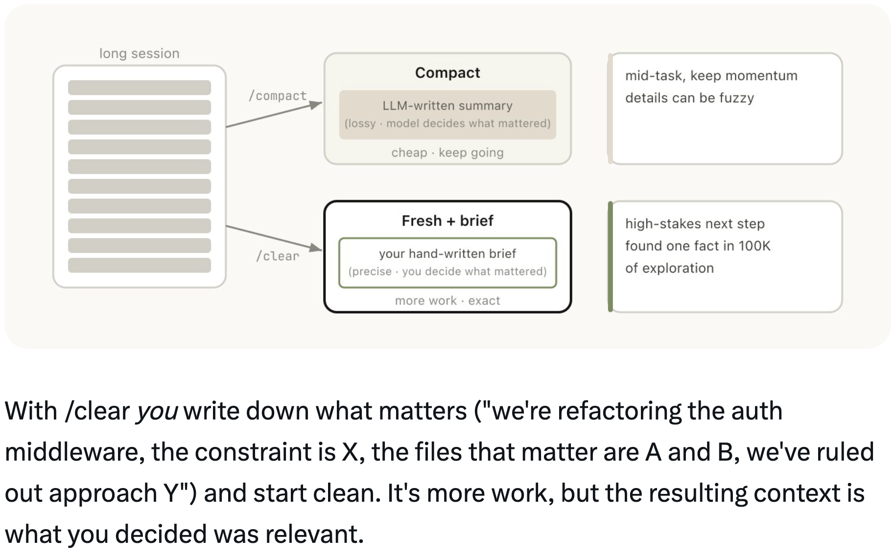
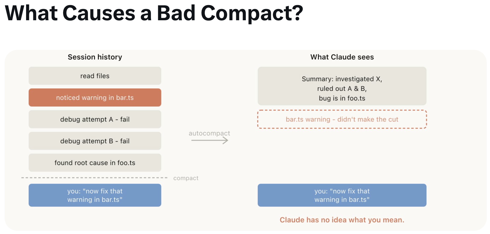
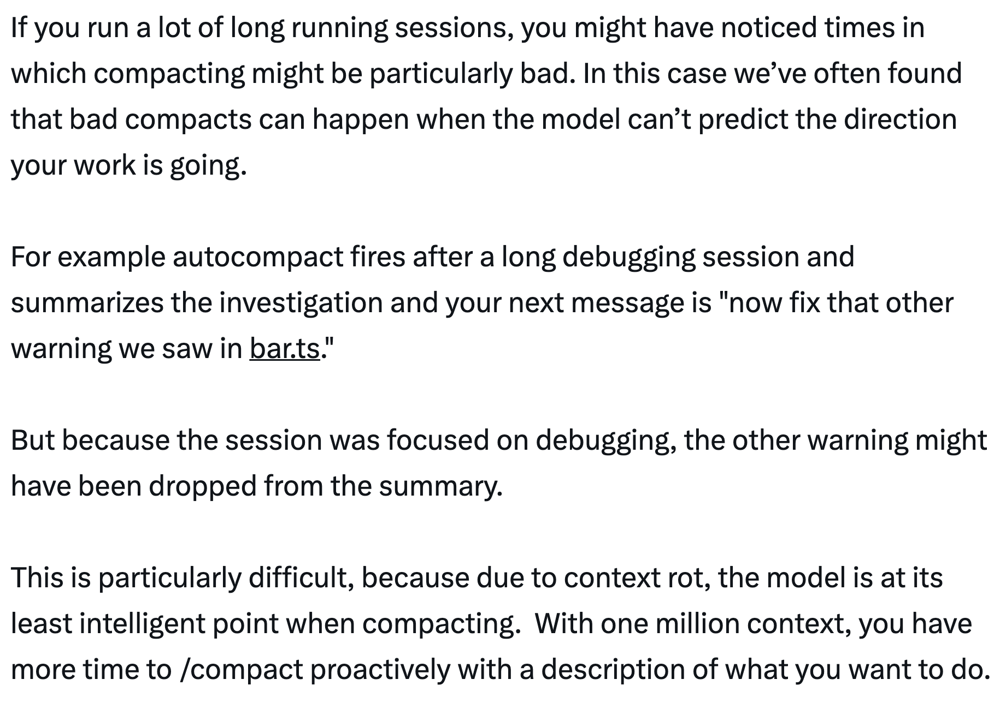
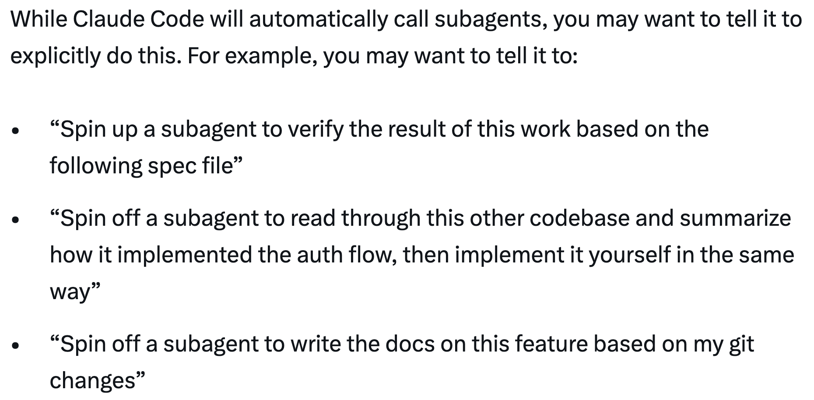
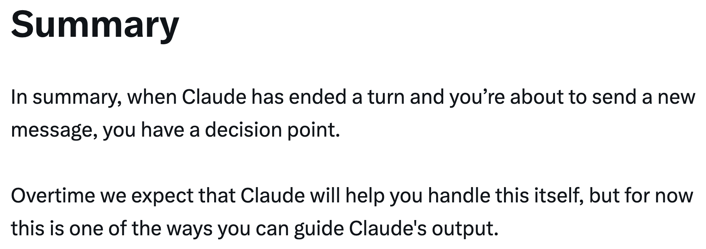
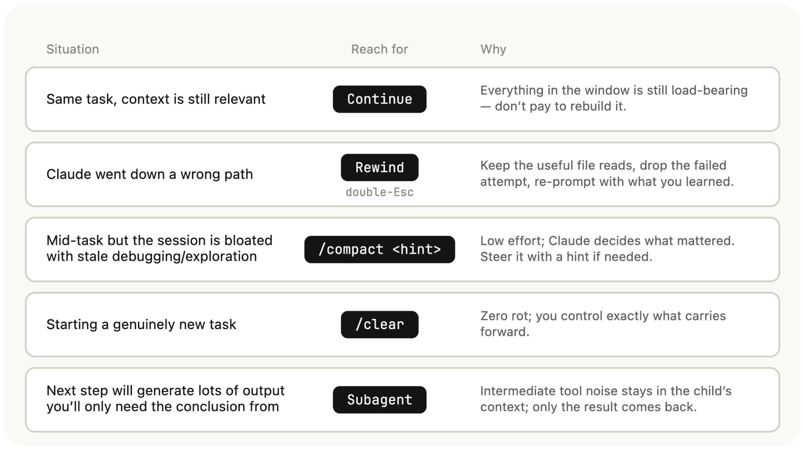

# Claude Code 会话管理与 1M 上下文 — Thariq

关于 Claude Code 会话管理、上下文窗口和压缩的指南，由 Thariq ([@trq212](https://x.com/trq212)) 于 2026 年 4 月 16 日分享。

<table width="100%">
<tr>
<td><a href="../">← 返回 Claude Code 最佳实践</a></td>
<td align="right"></td>
</tr>
</table>

---

## 背景

借助 100 万 token 的上下文窗口，Claude Code 可以更可靠地处理更长的任务——但这也带来了上下文污染的风险，如果你不够谨慎的话。**会话管理**比以往任何时候都重要：何时开启新会话、何时压缩、何时回退、何时委托给子代理。

---

## 上下文、压缩与上下文衰减快速入门

上下文窗口是模型在生成下一个回复时能够"看到"的所有内容。它包括你的系统提示、迄今为止的对话、每次工具调用及其输出，以及已读取的每个文件。Claude Code 的上下文窗口为 **100 万 token**。

不幸的是，使用上下文是有代价的——**上下文衰减（Context Rot）**。随着上下文增长，模型性能会下降，因为注意力被分散到更多的 token 上，而更旧的、不相关的内容开始分散对当前任务的注意力。对于 100 万上下文模型，上下文衰减大约在 **30-40 万 token** 时发生，但这取决于任务——并非硬性规则。

上下文窗口是硬性截止。当接近末尾时，你需要总结任务并在新的上下文窗口中继续——这就是**压缩（Compaction）**。你也可以主动触发压缩。

---

## 每一轮都是分支点

在 Claude 完成一轮之后，你有许多意想不到的选择：

- **继续（Continue）** — 在同一会话中发送另一条消息
- **/rewind（双击 Esc）** — 跳回上一条消息并从中重试
- **/clear** — 开始新会话，通常带着你从中提炼出的简要说明
- **压缩（Compact）** — 总结迄今为止的会话，并在摘要基础上继续
- **子代理（Subagents）** — 将下一部分工作委托给拥有独立干净上下文的代理，只把结果拉回来

虽然最自然的选择是继续，但其他四个选项可以帮助你管理上下文。

每个选项携带不同数量的现有上下文：

| 新会话 | 压缩 | 子代理 | 回退 | 继续 |
|:---:|:---:|:---:|:---:|:---:|
| 只有你的简要说明 | 有损摘要 | 全部 + 结果 | 保留前缀，截断尾部 | 保持一切 |
| *什么都没有* | | | | *全部保留* |

---

## 何时开启新会话

新的 100 万上下文窗口意味着你现在可以更可靠地完成更长的任务——例如，从头开始构建一个全栈应用。但这并不意味着你不应该开启新会话。

**一般经验法则：当开始一个新任务时，你也应该开启一个新会话。**

一个灰色地带是当你可能需要执行相关任务，而其中一些上下文仍然是必要的，但不是全部。例如，为你刚刚实现的功能编写文档。虽然你可以开启新会话，但 Claude 需要重新读取文件，这会更慢且更昂贵。由于文档可能不是高度智能敏感的任务，额外的上下文可能值得效率提升。

---

## 回退而不是纠正

如果 Thariq 必须选择一个能表明良好上下文管理的习惯，那就是**回退（Rewind）**。

在 Claude Code 中，双击 Esc（或运行 `/rewind`）可以跳回任何先前的消息并从中重新提示。从该点之后的消息会从上下文中删除。

**纠正**（在说"A 失败了"之后说"不，试 B"）会在上下文中留下失败的尝试：
> 上下文 = 读取 + 2 次失败尝试 + 2 次纠正 + 修复

**回退**（回到失败尝试之前，用你学到的知识重新提示）更干净：
> 上下文 = 读取 + 一个明智的提示 + 修复

回退通常是更好的方法。例如，Claude 读取了五个文件，尝试了一种方法，但不起作用。你的本能可能是输入"那个不起作用，试 X"。但更好的做法是回退到刚读完文件之后，用你学到的知识重新提示："不要用方法 A，foo 模块没有暴露那个——直接用 B。"

你也可以使用**"summarize from here"**让 Claude 总结它的学习并创建一个交接消息，有点像是从未来的自己发给过去尝试过但失败的自己的信息。

---

## 压缩 vs 新会话

一旦会话变长，你有两种方式减轻重量：`/compact` 或 `/clear`（重新开始）。它们感觉相似但行为非常不同。

**压缩（Compact）**要求模型总结迄今为止的对话，然后用该摘要替换历史。它是有损的——你信任 Claude 决定什么重要，但你不需要自己写任何东西。Claude 可能在包含重要学习或文件方面更全面。你也可以通过传递提示来引导它（`/compact focus on the auth refactor, drop the test debugging`）。

- **任务中途**，保持动力——细节可以模糊
- 成本低廉，继续前进

**新会话 + 简要说明**（`/clear`）意味着*你*写下重要的内容（"我们正在重构 auth 中间件，约束是 X，重要文件是 A 和 B，我们排除了方法 Y"）然后干净地开始。这需要更多工作，但 resulting context 是*你*决定的相关内容。

- **高风险**下一步——在 10 万探索中找到的一个事实
- 更多工作，更精确

---

## 什么导致糟糕的压缩？

如果你运行了很多长会话，你可能已经注意到某些时候压缩可能特别糟糕。糟糕的压缩可能发生在模型无法预测你的工作方向时。

例如，自动压缩在冗长的调试会话后触发并总结调查。你的下一条消息是"现在修复 bar.ts 中我们看到的另一个警告"。但由于会话集中在调试上，其他警告可能被从摘要中丢弃。

这尤其困难，因为由于上下文衰减，模型在压缩时处于最低智能点。有了 100 万上下文，你有更多时间主动 `/compact` 并描述你想做什么。

---

## 子代理与新的干净上下文窗口

子代理是一种上下文管理形式，适用于当你提前知道一部分工作会产生大量中间输出而你只需要结论时。

当 Claude 通过 Agent 工具生成子代理时，该子代理获得自己全新的上下文窗口。它可以尽可能多地工作，然后综合结果，这样只有最终报告返回到父级。

心理测试：**你会再次需要这个工具输出，还是只需要结论？**

探索噪音在子代理退出时被垃圾回收——20 次文件读取、12 次 grep、3 条死胡同——只有最终报告返回到父上下文。

虽然 Claude Code 会自动调用子代理，但你可能想明确告诉它这样做。例如：

- "启动一个子代理来根据以下规范文件验证工作结果"
- "派生一个子代理来阅读另一个代码库并总结它如何实现 auth 流程，然后你自己以相同方式实现"
- "派生一个子代理根据我的 git 更改编写此功能的文档"

---

## 总结

当 Claude 结束一轮而你即将发送新消息时，你有一个决策点。随着时间的推移，Claude 会自己处理这个，但目前这是你可以引导 Claude 输出的方式之一。

| 情况 | 使用 | 原因 |
|-----------|-----------|-----|
| 相同任务，上下文仍然相关 | **继续** | 窗口中的一切仍然是承载性的——不需要重建 |
| Claude 走了错误的路径 | **回退**（双击 Esc） | 保留有用的文件读取，丢弃失败的尝试，用你学到的知识重新提示 |
| 任务中途但会话因陈旧的调试/探索而臃肿 | **/compact \<提示\>** | 低成本；Claude 决定什么重要。如需要用提示引导 |
| 开始一个真正的新任务 | **/clear** | 零衰减；你精确控制什么向前携带 |
| 下一步会产生大量输出，你只需要结论 | **子代理** | 中间工具噪音留在子上下文中；只有结果返回 |

---

## 来源

- [Thariq (@trq212) on X — 2026 年 4 月 16 日](https://x.com/trq212)
